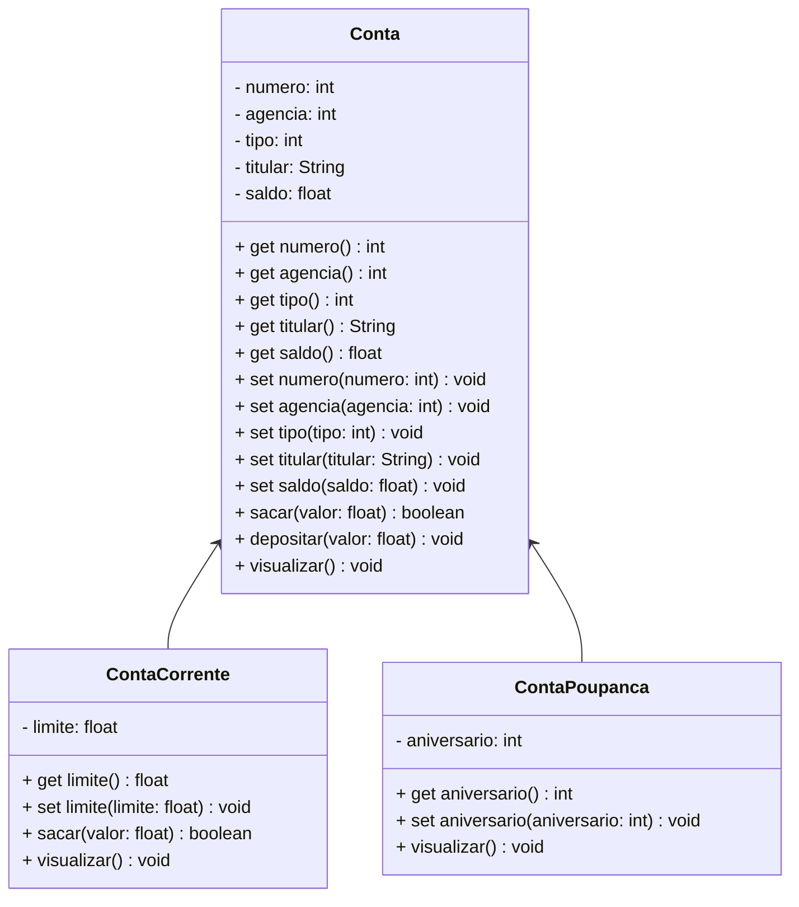

# 💳 Projeto Conta Bancária

## 📌 Descrição  
O **Projeto Conta Bancária** é uma aplicação Java desenvolvida com foco em **Programação Orientada a Objetos (POO)**, simulando a gestão de contas bancárias. O sistema permite operações como **criação, consulta, atualização e remoção de contas**, além de **transações financeiras** como **depósitos, saques e transferências**.

### Objetivo  
O principal propósito é **automatizar e simplificar** o controle de contas **Corrente e Poupança**, proporcionando aprendizado prático sobre:
- 📌 **Classes e Objetos**
- ⚙️ **Atributos e Métodos**
- 🔒 **Modificadores de Acesso**
- 🔄 **Herança e Polimorfismo**
- 🏗 **Classes Abstratas**
- 🏷 **Interfaces**  

Este projeto **serve como simulador funcional** e **base de estudo** para quem deseja aprofundar os conceitos fundamentais de **POO em Java**.

---

## ⚙️ Funcionalidades  
- **Criar Conta** – Adiciona uma nova conta com dados do titular, agência, saldo inicial e tipo. O número da conta é gerado automaticamente.  
- **Listar Contas** – Exibe todas as contas registradas.  
- **Consultar Conta por Número** – Busca por uma conta específica.  
- **Consultar Conta por Titular** – Mostra todas as contas associadas ao nome informado.  
- **Editar Conta** – Permite alterar os dados de uma conta existente.  
- **Excluir Conta** – Remove uma conta do sistema.  
- **Saque** – Retira um valor da conta, respeitando o saldo disponível.  
- **Depósito** – Acrescenta um valor ao saldo.  
- **Transferência** – Move fundos entre duas contas, com verificação de saldo e limites.

## 📊 Diagrama de Classes  
O projeto inclui um **Diagrama de Classes**, que ilustra a arquitetura orientada a objetos da aplicação, mostrando as **relações entre classes, métodos e atributos** – facilitando o entendimento do sistema.

 

## Tecnologias Utilizadas   

- **Java JDK 17** ou **superior**  
- **Spring Tool Suite (STS)**
- **Git** e **Github**
 

## Sobre o Projeto  

Este repositório é parte de um **projeto educacional** da **Generation Brasil**.  
Desenvolvido por **Lívia D'Alexandri** durante o **Bootcamp Java Fullstack - Generation Brasil**.  

